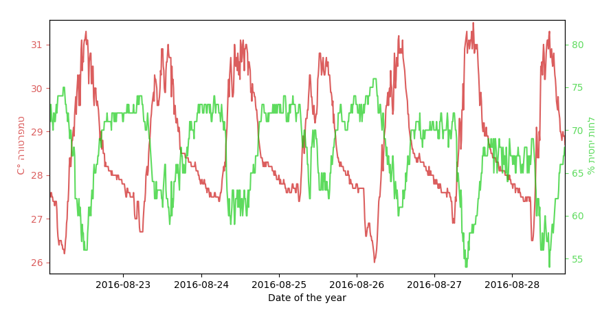
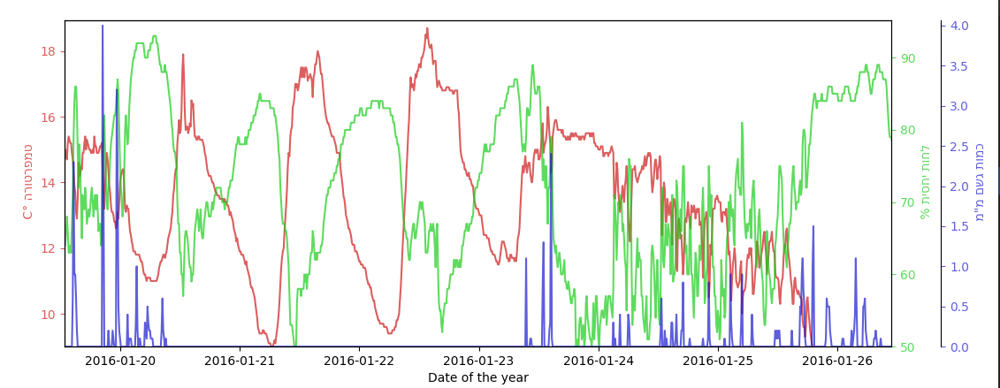

# Israel_Weather_Data_Plotter
a serieas of scripts that I used in order to plot whether data from the israely metorological database 

the israely meteorological service provides an interface through which you can download metorological measurments in csv format. this set of scrips allows the user to display the data in these files in varias charts.

## histogram animations

### day night cycle average over 7 years: 2014 - 2020

### seasons cycle average over 7 years: 2014 - 2020

## plots
### ordinary israely summer week

### rainless israely winter week

### rainfull israely winter week

